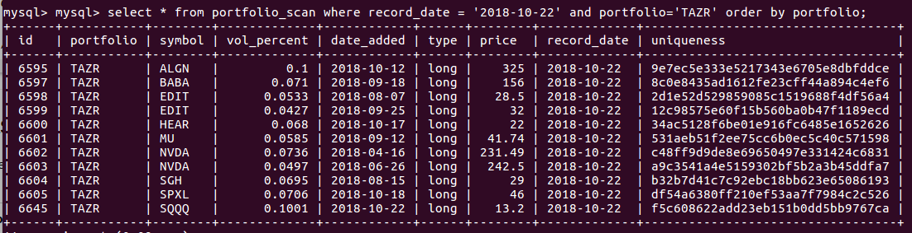
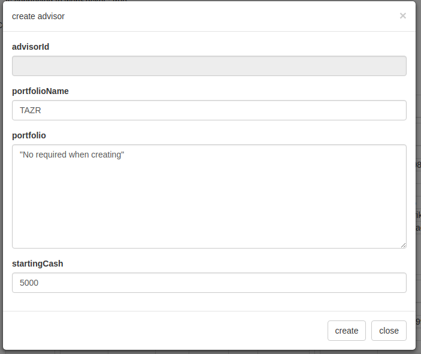
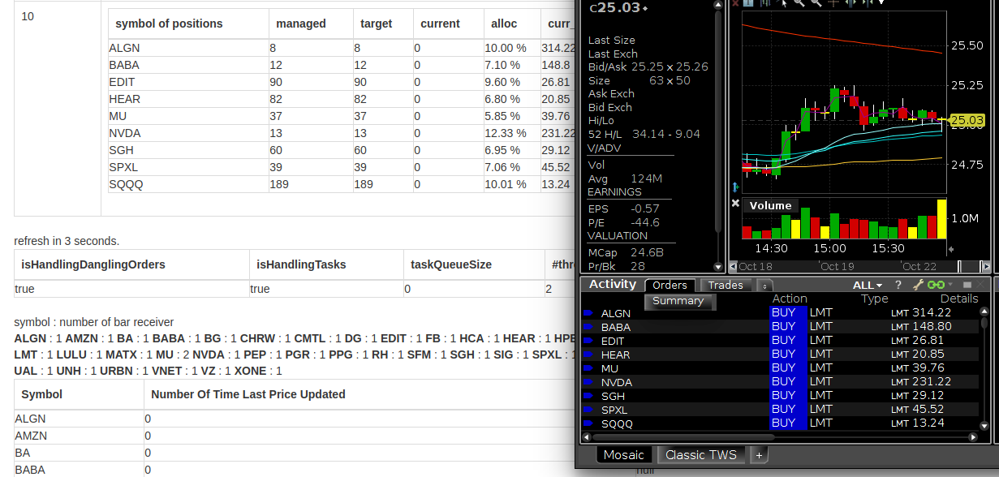

# 自动化股票交易实现选股组合跟踪

这个小项目的目的是用自动化股票交易的跟踪一个Mysql数据库表里面记录的持仓情况。目标用户是那些没有时间
一直盯着股市，并且想要躲避一些突然的股票下跌或者想实践一下自己对美股研究的办公室上班族。

__希望的效果就是,不管你是用什么工具,语言作的分析,只要把结果写到Mysql表中,剩下的股票交易就交给这个程序来执行.__

 

## 安装

1. (TODO) 目前, 请直接联系我 (bowei_liu@ymail.com), 我会免费提供一个Amazon Machine Image, CloudWatch Events 和一小段 python的Lambda Function代码.
程序会在股市开市之前启动,闭市1小时左右结束.

## 使用方法
0. 先决条件,在Interactive Brokers开了户, IB是美股最主流的自动化交易券商.
1. 如下图所示, 把目标股票持仓情况写到一个数据库表中  
   
2. 确认股票跟踪软件, IB 的TWS或者IBGateway在运行.
3. 浏览器转到 `/mainPanel`, targetClass选择 `PortfolioTrackAdvisor`, 然后点击"Prepare"
4. 在弹出对话框中,输入投资组合的名字, 分配的起始现金  
    
5. 点击"create", 然后生成的PortfolioTrackAdvisor右边点击"start"
6. 如果创建PortfolioTrackAdvisor的时候是闭市的状态,我们可以在TWS上看到提交的限价订单(本软件只提交限价订单,具体价格会随着当前成交价浮动,并且留出一定空间). 每一个订单的
   股数都是根据起始现金和当前股价计算出来的. 如果创建PortfolioTrackAdvisor是开市状态,我们会看到订单被提交和执行.  
    
7. PortfolioTrackAdvisor会跟踪数据库表中最近的投资组合结果来决定当前开,闭,加,减仓. 最近的依据是根据表中`record_date`列来定的. 
   如果在同一天中投资组合有变化,可以在数据表里更新目前仓位的情况, 如果到新的一天, 投资组合没有变化,则可以选择插入或者不插入新的投资组合数据.

## 问题

1. 我的选股会被这个程序盗走吗?  
   回答: 不会,这个程序中没有相关后门,这是你知识财产. 你可以选在在一个VPC中运行这个EC2, 通过配置安全策略,阻挡任何你不想要的网络连接. 

2. 运行这个EC2的大致AWS开支是多少?  
   回答: 大约13美元. EC2运行只比市场运行的时间多1小时. 节假日不会启动. 

## 向项目贡献
1. 我还在想,以何种形式接受贡献. 我目前希望项目简单,只做执行,和写一些简单的帮助策略研究的API. 我的目标是我免费贡献一个执行软件, 会数据分析的朋友免费提供一些策略给我, 我们互相帮助.   

## 测试

## 历史

自2017年6月1日开始

## 感谢

## 许可

