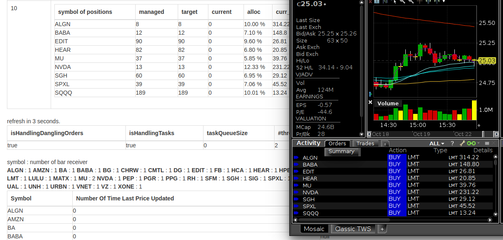

# Portfolio Tracking, Automated Stock Trading

This project is intended to track stock allocation recorded in a mysql database table once per 
minute.

## Installation

1. (TODO) For now, please directly contact me, I will provide one Amazon Machine Image, 
CloudWatch events and a small piece of python lambda function code, so the program starts 
before trading starts and exists after market closes.

## Usage
1. Write your stock allocation data to a Mysql data table, like following
   
2. Make sure Portfolio Tracker is running, TWS or IBGateway is on,
3. Go to `/mainPanel`, and select `PortfolioTrackAdvisor`, then click "Prepare"
4. In the pop-up modal, input portfolio name, and desired cash to be allocated at "startingCash"  
    
5. Click button "create", then click start
6. If market is closed at the time of creating this PortfolioTrackAdvisor, we can see limit orders
   submitted. Position of each symbol is calculated based allocation percentage and recent quote 
   price of each symbol. If market is open at the time, we shall see orders get submitted and executed.
    
7. Then Portfolio Tracker is going to track change of allocations of this portfolio using newest 
   `record_date`. This means one can choose to write allocations to database each day, or write whole
   portfolio allocations to database only when a change has been made to portfolio allocation.

## Contributing
1. still thinking, want to keep this project simple.

## Tests

## History

Started at Jun. 1st.

## Credits

## License
