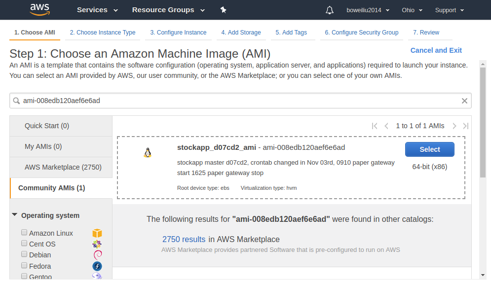
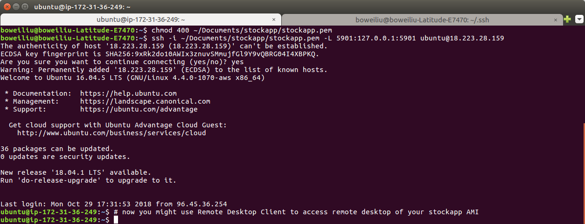

## Installation guide for running Stockapp using Amazon Machine Image (AMI) 

The majority of this installation guide is about how to create a new Amazon EC2 instance, if you 
have created EC2s before, the content should be quite familiar with you.

1. make sure you have an active AWS account. The Login at [AWS Management Console][1]
2. Choose region __US East (Ohio)__, because the AMI to use is at this region, and AMI is region-bound.
3. Create one IAM role (the instance running the AMI will be using this IAM role, skip if you already have). 
   I used the one I already have, which has only one rule, AmazonEC2FullAccess. 
4. In left-top corner of page, click Services drop down then choose EC2.
5. In input box asking for "Amazon Machine Image (AMI)", type `ami-0336ee7e585e61faa`, you will find
   this AMI in category "Community AMI", of which the name is "stockapp_d07cd2_ami"
   
   This image is based on Ubuntu 16.04(ami-0782e9ee97725263d). It has been added one mysql server, 
   [IB Gateway software 972.1p][2], [ibc][5] (required for automatic IBGateway launching and 
   stopping), VNC desktop server, and the [__Stockapp__][3] for automated stock trading.
   
   
6. Choose instance type t2.small, pricing of t2.small in region US East (Ohio) at the time of writing
   is $0.023 per Hour
   
   
7. Configure Instance:   
   number of instance : 1   
   Network: keep default   
   subnet : No preference   
   Auto-assign Public IP : Use subnet setting (Enable)  
   Placement group: NOT checked  
   IAM Role: ec2_fullaccess, this one depends on yourself.
   Shutdown behaviour: Stop  
   Enable termination protection: Not checked  
   Monitoring: Not checked  
   Tenancy: Shared - Run a shared hardware instance  
   T2/T3 Unlimited: Not checked
   Advanced Detail: did not change, left empty.  
   
   
8. Add Storage: please refer screenshot. 30 GB should be enough.

   
9. Configure Security Group: No matter you choose to use existing security 
   group, or create new one, the bottom line is that you need to guarantee the security group has 
   following 3 + 1 rules added:
   1. TCP 22 for SSH administration
   2. TCP 8080 for Web panel management
   3. TCP 3306 for mysql port
   4. TCP 80 reserved for future web panel management (optional)
   
   
10. Review and launch, click launch, select or create a new key pair. The bottom line is that you 
   need to know where you stored your .pem file. After clicking Launch Instances, you should be able
   to see following:  
     
   

11. Confirm successful running of Stockapp image. Please go to EC2 service dashboard, then click 
    __Running Instances__, should be able to observe the instance just launched by you. Copy the IP 
    address of the instance you just launched. You will need it. In this installation guide, it is
    18.223.28.159. This is just a temporary IP address assigned by AWS automatically.   
      
    

12. SSH into the instance
      
    Explanation of the commands, `chmod 400 <path_to_stockapp.pem>`, make this file readable only 
    by yourself, revoke all other R/W/Execute accessibility of *user group* or *all*. This is required
    by AWS.  
    `ssh -i <path_to_pem_file> -L 5901:127.0.0.1:5901 ubuntu@18.223.28.159`: This shell command 
    means initiate SSH connection using pem file supplied as security credential, and also build 
    port forwarding between remote 5901 port and local 5901 port. 5901 Port means the 1st VNC remote desktop (5900 + 1).
    For detail, please refer [Install VNC on Ubuntu 16.04][4]

13. If you are able to SSH into the instance, it means you have completed installation of Stockapp using AMI.  

[1]: https://aws.amazon.com/console/
[2]: https://www.interactivebrokers.com/en/index.php?f=16457
[3]: https://github.com/bovetliu/PortfolioTrackingIntro/releases/tag/1.0
[4]: https://www.linode.com/docs/applications/remote-desktop/install-vnc-on-ubuntu-16-04/#connect-to-vnc-from-your-desktop
[5]: https://github.com/IbcAlpha/IBC
