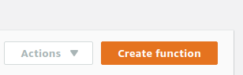

## Setting auto starting and shutting down every workday.

It will use Cloudwatch events and Lambda function.

1. Make sure you have an appropriate role that lambda function is going to assume. For example, I 
   have a role named "lambda_ec2_onoff". Its policy is 
   ```json
   {
       "Version": "2012-10-17",
       "Statement": [
           {
               "Effect": "Allow",
               "Action": [
                   "logs:CreateLogGroup",
                   "logs:CreateLogStream",
                   "logs:PutLogEvents"
               ],
               "Resource": "arn:aws:logs:*:*:*"
           },
           {
               "Effect": "Allow",
               "Action": [
                   "ec2:Start*",
                   "ec2:Stop*",
                   "ec2:Describe*"
               ],
               "Resource": "*"
           }
       ]
   }
   ```
    
2. change directory to `<project_root>/scripts/StartStopEc2InstancesLambda`, use bash shell to run
   `install_dependency.sh` and `zip_lambda_expression.sh`. After running, one zipped file, 
   containing necessary contents inside directory `StartStopEc2InstancesLambda` will be created 
   in parent folder, namely `<project_root>/scripts`
   ```bash
   bash ./zip_lambda_expression.sh
   ```
3. Go to Lambda service of region Ohio.  Click "Create function" button.  
   
   
4. fill form using  
   Name:  _start_stop_instances_.  
   Runtime: _python 3.6_,  
   Role: _choose an existing role_  
   Existing role: _lambda_ec2_onoff_ 

5. Upload zipped file created in step 2. Then click "Save" at right upper corner.  
   

6. Go to CloudWatch services. In the left menu, click "Rules" under "Events", then click 
   "Create rule"
   
7. Event Source click "Schedule" radio button, Cron expression `0 13,14 ? * MON-FRI *`, targets 
   choose "Lambda function", function choose "start_stop_instances". Configure input to be 
   "Constant (JSON text)". Copy content in file 
   `<project_root>/scripts/StartStopEc2InstancesLambda/instance_start_event_constant.json` to input 
   box of "Constant (JSON text)". Then click "Configure detail".
   
   Explanation, this event will be invoked twice at GMT 13:00 and 14:00 in every work day. This rule
   is going to trigger execution of Lambda function _start_stop_instances_ with event content in 
   `instance_start_event_constant.json`. The event object is available as a parameter of 
   interface function `lambda_handler(event, context)`. The content in event specifies that instance
   will only be started when Lambda function is invoked between 08:55am ~ 09:05am of 
   America/New_York timezone.  
   
   
8. Name rule to be "StartEc2RunningIBGateway", input desired description then click "Create rule".

9. Next, create cloud watch event rule "StopEc2RunningIBGateway" like what is done in step 6-8.
   Go to CloudWatch services. In the left menu, click "Rules" under "Events", then click 
   "Create rule".

10. Event Source click "Schedule" radio button, Cron expression `0 21,22 ? * MON-FRI *`, targets 
    choose "Lambda function", function choose "start_stop_instances". Configure input to be 
    "Constant (JSON text)". Copy content in file 
    `<project_root>/scripts/StartStopEc2InstancesLambda/instance_stop_event_constant.json` to input 
    box of "Constant (JSON text)". Then click "Configure detail".
    
11. Name rule to be "StopEc2RunningIBGateway", input desired description then click "Create rule".