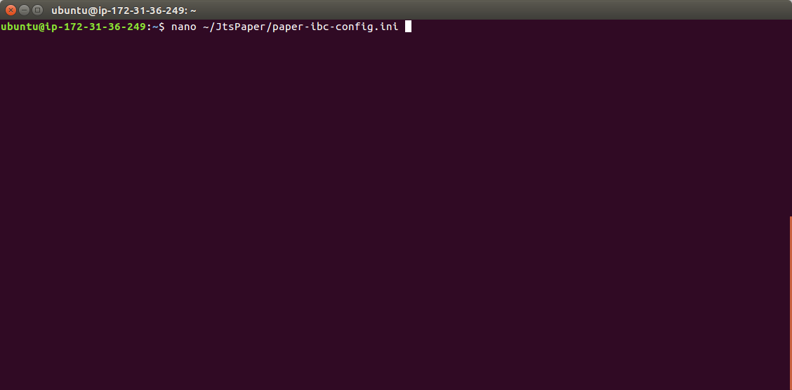
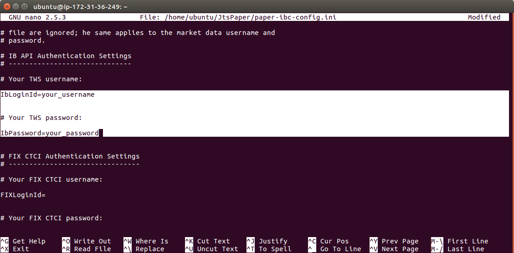
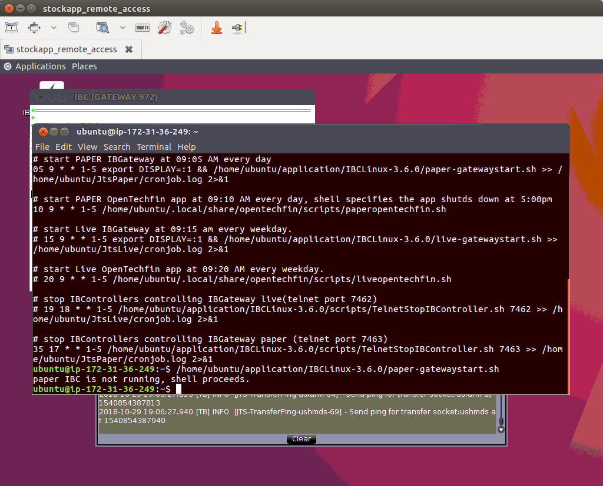
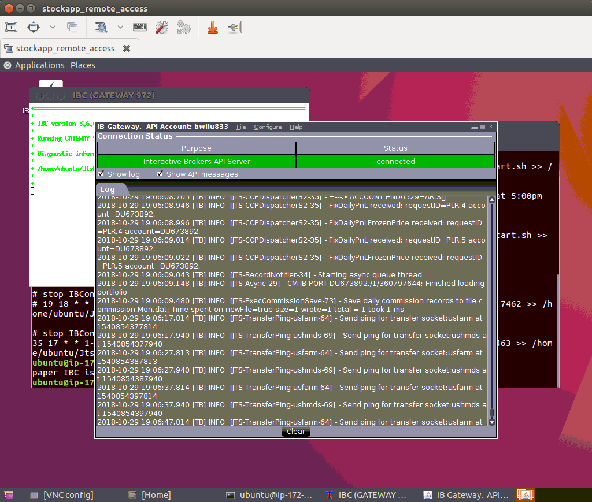
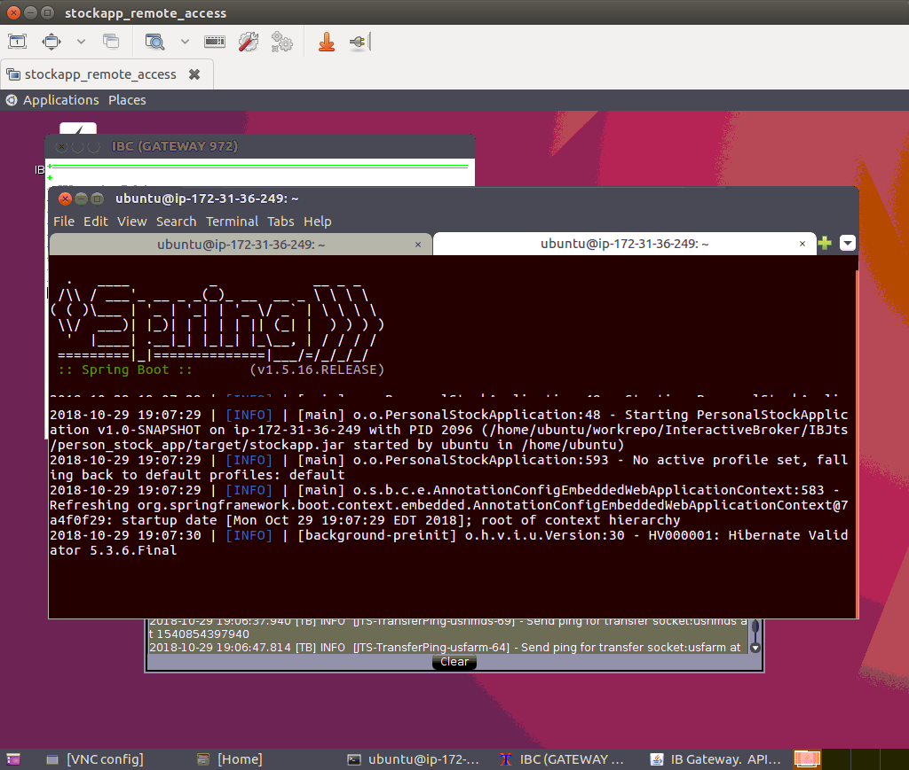
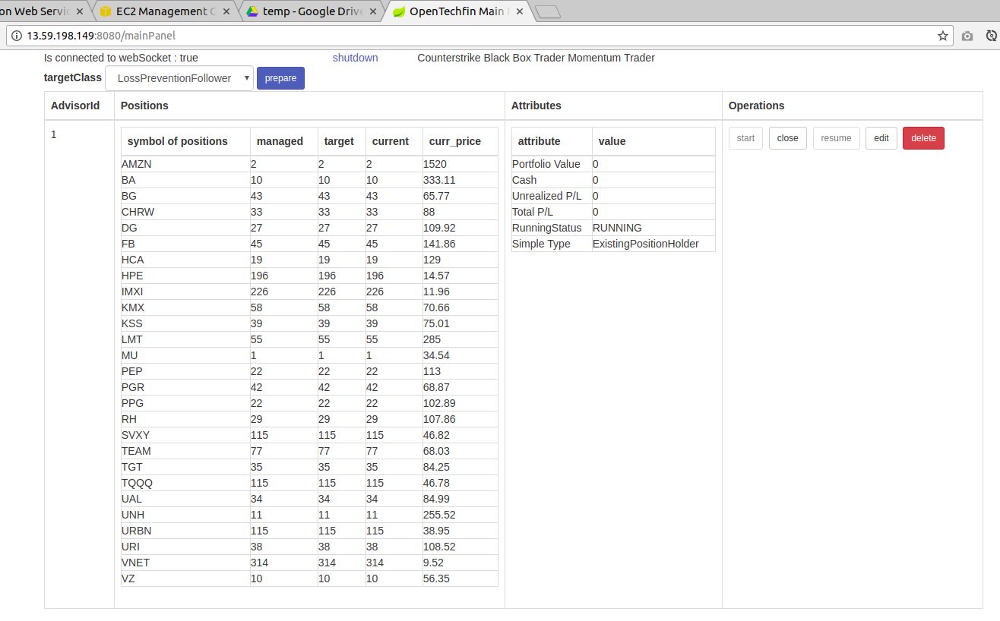

## Setting up required before using stock app 

1. __(Skip if you are using local stockapp.jar)__ Ssh into the instance created by you.   
   sample bash:
   ```bash
   ssh -i ~/Documents/stockapp/stockapp.pem -L 5901:127.0.0.1:5901 ubuntu@18.223.28.159 
   ```
2. __(Skip if you are using local stockapp.jar)__ Since the stockapp instance has VNC remote desktop 
   server installed, please refer [Install VNC on Ubuntu 16.04][1] to see how to connect using 
   remote desktop. Please be aware, you don't need to install VNC server again, it has already been 
   installed.
     
   __VNC password is "123456"__ without quotes, just 6 digits.
   
3. Change username and password used by ibc. IBC is a software widely used to automatically start 
   and shutdown IBGatway or IB TWS software. Use any text editor you feel comfortable to edit following
   file: `~/JtsPaper/paper-ibc-config.ini`. I used _nano_ in this setting-up guide.  
     
   Search for text pattern "IbLoginId=", input your ib username after "IbLoginId=", 
   then input your ib password after "IbPassword="  
     
   
At this stage, you have actually finished setting up, but for users curious about how to manually 
run this software, please follow following steps:    
   
1. Create one terminal in remote desktop, type "crontab -l" to see commands scheduled to run.
   In that terminal, enter command containing "paper-gatewaystart.sh" like following screen shot.  
       
   
2. Check whether IBGateway software is started or not. Following screen shot shows IB gateway is 
   successfully started, seen in remote desktop.  
   

3. Click the terminal you created in step 4, to make sure it is highlighted by cursor. In keyboard,
   type "ctrl + shift + T" to create a sibling terminal. Then copy and enter the command containing
   "/scripts/paperopentechfin.sh", should be able to see console logging information like following:  
     
   This means stock app is started and running.

4. In your browser type the ip of your AWS instance plus port 8080, (https://<IP_Address>:8080/), 
   then click link "mainPanel". 
   You should be able to see a ExistingPositionHolder created automatically, which holds positions 
   of stocks that you already have in your IB account. In the screen shot, the portfolio value is 
   zero because it was launched in off-market time, there are no stock price-quote bars to replace 
   default price-quote bars. If created in market time, portfolio value will be a normal value.   
   
   
5. To shutdown stock app, click the shutdown link at top of mainPanel. Once see stock app logs showing it is 
   been shutdown. 
   
6. To shutdown ib gatway, type commands 
   `/home/ubuntu/application/IBCLinux-3.6.0/scripts/TelnetStopIBController.sh 7463`
  


   

   
[1]: https://www.linode.com/docs/applications/remote-desktop/install-vnc-on-ubuntu-16-04/#connect-to-vnc-from-your-desktop